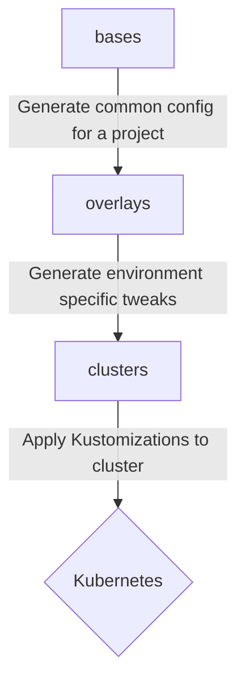

# GitOps Core

## This is complicated, where should I go?

Depending on what you're trying to do, you'll need to go to the appropriate directory to affect changes.

* bases
  - Core structure of Kubernetes Kustomizations, no environment specific configuration, changes here apply to ALL clusters, production included.
* overlays
  - Environment specific configuration of Kustomizations from the `bases` directory.
* clusters
  - Informs Flux what it should be deploying, each instance of Flux monitors a different subdirectory here.


## So, how does this all flow together?



## Bootstrapping

We're currently not bootstrapping Flux 2 within clusters with Chef at cluster creation, as such, see example command below to bootstrap a new cluster. Available environments are pretty much the output of `ls clusters`.

```shell
$ export GITOPS_ENV=uksouth-dev
$ flux bootstrap gitlab \
    --components-extra=image-reflector-controller,image-automation-controller \
    --hostname=git.bink.com \
    --owner=GitOps \
    --repository=core \
    --branch=master \
    --path=clusters/$GITOPS_ENV
```
